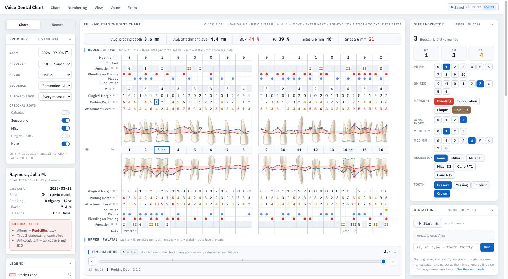

# Voice Dental Chart

Full-mouth six-point periodontal charting for all 32 teeth — anatomical
tooth-and-root graphics, a millimetre-ruled pocket graph, voice dictation, and
every field a US periodontal exam records.



## What is on that screen

**Top** — a menu bar (Chart · Numbering · View · Voice · Exam) and the autosave
indicator, which names the store it is writing to. Nothing else is permanent up
there; once-per-visit actions live in the Exam menu.

**Left** — the provider card describes the visit: date, clinician, probe,
probing sequence, how far the cursor advances after each value, and which
optional rows are on. Below it the patient card, which never folds away. The
`Chart` / `Record` switch swaps this rail for the edit history.

**Centre** — the chart itself, laid out the way a paper chart is: four bands,
each arch split at the midline, with the roots always facing the data rows that
describe them. Above the teeth are the measurement rows; the red line is the
gingival margin, the blue line the attachment level, and the band between them
the pocket. Bleeding shows as a dot on the pocket floor, furcations as
triangles on the root trunk.

**Between the arches** — the time machine. Drag it and every value on screen
walks back through what was typed, then forward again.

**Right** — the site inspector for whatever the cursor is on, and the dictation
card, where speech and typing enter the same pipeline.

## Running it

```bash
npm install
npm run dev            # API on :5181 and the app on :5180, together
npm run dev:web        # app only — persistence falls back to localStorage
npm run dev:api        # API only
npm run build          # type-check + production bundle
npm run build:artifact # single inlined HTML file for publishing
```

## Layout

```
src/
  domain/       framework-free. Nothing here imports React.
    types.ts      chart, cursor and exam types
    numbering.ts  Universal / FDI / Palmer, arch order, site order
    anatomy.ts    per-tooth anatomy, cusp counts, furcation sites, MGJ rules
    geometry.ts   SVG path generation and the lighting ramps  ← cached, pure
    voice.ts      the recognition pipeline: normalisation, numbers, segments
    bands.ts      the four bands and their row stacks
    sample.ts     deterministic demonstration exam
    metrics.ts    whole-mouth indices and AAP/EFP 2017 staging
  state/
    chartReducer.ts  every mutation, plus the probing sequences
    usePersistence.ts autosave, draft restore, filing an exam
    useVoice.ts      one entry point for the microphone and the keyboard
  lib/
    dictation.ts     chairside shorthand parser
    recognizer.ts    Web Speech wrapper, including the on-device path
  components/     presentation only
server/
  schema.sql      the two persistence tiers, documented inline
  db.mjs          queries; uses node:sqlite, so there is no native dependency
  index.mjs       a small HTTP API over node:http
data/perio.sqlite the database, with the demonstration exam already in it
```

## Why the geometry sits outside React

The chart draws roughly 500 SVG paths. None of them change while an exam is
being recorded — a probing depth moves the graph polylines, never the teeth.
`geometry.ts` therefore generates each tooth once and caches it by tooth and
surface, `<Tooth>` is `memo`ised on primitives, and the cast-shadow layer is
memoised on a status signature. Typing a value reconciles the handful of cells
and polylines that actually changed.

The two aspects of a tooth are not the same shape, and are not drawn as one.
Anterior crowns converge lingually and carry a cingulum; a maxillary premolar's
palatal cusp is shorter than its buccal one; a mandibular first molar shows
three cusps buccally against two lingually; and on a maxillary molar the
palatal root is the one nearest the viewer from the palatal. The facial surface
is convex and the lingual is hollow, so they take opposite lighting — highlight
in the middle on the facial, marginal ridges lit and the fossa shaded on the
lingual.

## Persistence

Two tiers, because a draft and a record want opposite things.

`exam_draft` is the working copy: one row per exam holding the whole state as
JSON, rewritten on a 600 ms debounce as the clinician types. It is cheap enough
to write constantly and it is what a closed laptop recovers from.

`exam` / `exam_tooth` / `exam_site` are the committed record, written once in a
transaction by **Exam ▸ Complete exam** — normalized so later exams can be
compared against it, and never half-written.

`edit_log` is the audit trail: every value change appended as it happens with
the tooth before and after. Undo does not retract log rows; the draft's index
is what says where the clinician currently is.

If the API is unreachable the app keeps working and writes the draft to
`localStorage` instead — the save indicator says which store is in use.

The draft carries the view as well as the data: which panels are folded, which
arches show teeth, the numbering, the entry protocol. **Reset everything** in
the Exam menu clears all of it back to the sample exam — only the history
counter keeps climbing, because the edit log is keyed by `(exam, seq)` and
restarting it would collide with the discarded entries.

## Edit history

Up to 10,000 edits are kept in memory as tooth-level before/after patches, so
undo is a replacement rather than a replayed calculation that could drift. The
time machine seeks to any point by collapsing the walk into a single patch,
which stays smooth while it is dragged and is exact even when several edits
touch the same tooth. ⌘Z / ⇧⌘Z work anywhere on the page.

## Voice

Speech and typing enter the same function, so a typed phrase is normalised and
parsed exactly like a recognised one — that is how the grammar is tested and
demonstrated without a microphone. The pipeline is
`heard → fillers → vocabulary → numbers → segments → parse`, and an utterance
below the confidence threshold is held for confirmation rather than written.
One breath can carry several commands: `"tooth thirty two, five four six,
bleeding"` splits at the commas and each segment is parsed against the cursor
the one before it left behind.

Recognition is the browser's own Web Speech API — no service, no key, no
dependency. Chrome's default path streams audio to its servers, so
**Voice ▸ Dictation Setup** exposes the on-device option (`processLocally`)
with the model's install state; for a chart holding patient data that choice
belongs in front of the clinician rather than in a default.

## The side panels

The icon beside the Chart / Record tabs folds both flanks away and centres the
chart. It is one fixed button rather than one per state, so folding changes
what is beside it and never where it is. Folded, the edges of the window are
live: hovering either one slides that panel back over the chart for as long as
the cursor stays on it, and clicking it pins the layout open again.

The chart column is the arch's width and does not stretch into spare room. When
the room runs out it does not squeeze either: the grid steps to a tighter
density — narrower site columns and gutter, with the tooth drawings scaling to
match — so an iPad Pro shows the whole arch rather than half of one. One table
in `domain/density.ts` drives both the CSS grid and the SVG, so the teeth
cannot end up measuring columns that have since changed. Below the tightest
density the app states the requirement and the shortfall instead of quietly
degrading into something that invites the wrong tooth getting the reading.

**Dev ▸ Form factor** is how that was checked: iPad Pro landscape holds the
full-size grid, portrait steps to compact, and both fit the frame whole.

## Checking the layout at other sizes

**Dev ▸ Form factor** renders the whole app at a chosen viewport — FHD, 4K at
100 % and at the 150 % it is usually run, and iPad Pro in both orientations —
and scales it to fit the window. A page cannot resize the window it is in, and
a 4K viewport does not fit on most screens anyway, so this is the same approach
the browser's own device toolbar takes. Viewport units inside follow the frame
rather than the real window, so panel heights measure what they would measure
on the device.

## Conventions

- **GM** positive = recession apical to the CEJ; negative = margin coronal to it.
- **CAL** is computed as `PD + GM`. Typing a CAL value back-solves the margin,
  so the three numbers can never disagree.
- The CEJ scallop on each tooth meets the 0 mm reference line at the mid-facial.
- Roots always face the adjacent data rows, so each band's numbers sit beside
  the part of the tooth they describe.
- Right-click a tooth to cycle missing → implant → crown → present. On a tablet
  a double tap does the same; the tooth rows set `touch-action: manipulation`
  so the second tap cycles rather than zooming.

The patient, the exam and every measurement are invented for demonstration.
`data/perio.sqlite` ships with the repository so the app has something to open
on a fresh clone — it holds that sample exam and the edits made while building
it, and no real record.

`legacy/` holds the original single-file prototype that this project was ported
from. It is kept for reference and is no longer maintained.
